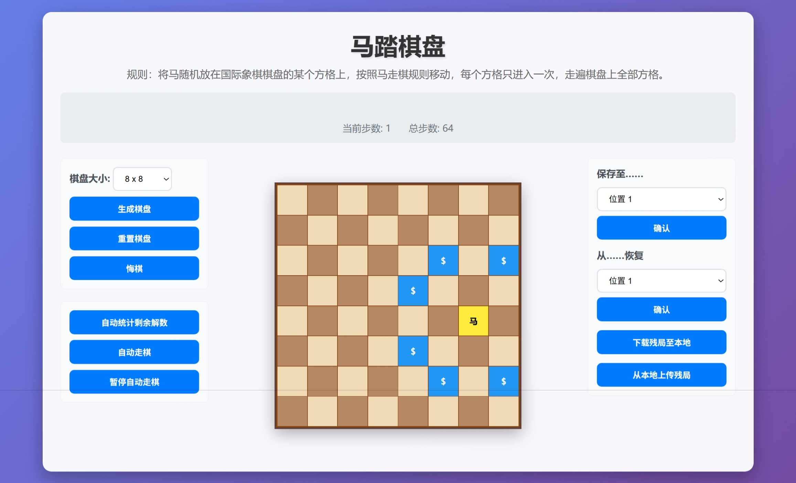

# LAB5 马踏棋盘

```
实验题目：马踏棋盘 
问题描述：设计一个国际象棋马踏遍棋盘的程序。将马随机放在国际象棋棋盘的某个方格上，按照马走棋规则移动，每个方格只进入一次，走遍棋盘上全部64个方格。 
解题要求：求出马的行走路线，将数字1，2，…，64依次填入8×8的方阵并输出。 
```

## 1.需求分析

- 手动走棋：生成棋盘并手动挑战走棋，可悔棋

- 自动判断和走棋【核心】：实现算法来判断继续完成的解法数/完成剩余步骤
- 多棋盘：可同时开启多个棋盘挑战并切换

- 分享需求：通过下载棋盘信息并传递让好友来挑战残局

## 2.概要设计

### 2.1 设计思想

架构：前后端分离，后端主要负责算法和保存相关，前端负责图形化渲染和交互

算法核心：Warnsdorff贪心策略，优先选择后续可走路线最少的节点进行深搜和回溯

### 2.2 存储结构设计

棋盘存储结构采取两种方式，根据前后端交互任务的性质而采取不同的策略

​	**走棋**相关：

​		需求：尽可能地快返回结果，因此传输完整棋盘来“空间换时间”，避免解析时间。

​		设计：前端->后端 当前棋盘大小 n / 状态 n*n （-1为已落子，0为空）/ 当前落子位置

​					前端<-后端 路径栈

​	**棋局保存**相关：

​		需求：需要保存在后端数据库，因此要尽可能节省空间，同时要保存路径信息。故采取路径栈来“时间换空间”。

​		设计：前端<->后端 当前棋盘大小 n / 路径栈 

此外，棋盘参数使用类的成员存储，避免深搜时大量递归调用爆栈

## 3.详细设计

### 后端

**实现**：python的flask框架 + SQLite数据库

**接口设计与功能**：

- 走棋相关：表单json传参当前棋盘

​		`/api/auto-check`	判断继续走棋的解法

​		`/api/auto-move`	自动完成剩余走棋步骤，分段返回剩下k步路径（每步通过1-8来标识跳法）

- 棋局保存相关：表单json传参 当前棋盘大小 n 以及 已走路径（每步通过1-8来标识跳法），存储入SQLite（uuid为key）

​		`/api/save`	保存残局棋盘到指定保存位（1/2/3）

​		`/api/recall`	从指定保存位恢复棋盘

​		`/api/download`	下载当前残局棋盘，返回json文件

​		`/api/import`	上传棋盘json文件到当前棋盘

### 前端 

**实现**：html + JavaScript + CSS 三件套

**详细功能**：

- 棋盘生成：根据设定 n(4-10) 值生成 n * n 棋盘，并随机初始化马的初始位置
- 判断当前棋盘继续走棋可能性：直接调用接口`/api/auto-check`
- 继续走棋：调用接口`/api/auto-move`，并动画演示走棋结果（将步数数字填入棋盘）
- 手动挑战：鼠标点击下一步位置，js判断落子是否合法
- 悔棋：通过前端js维护一个路径栈实现，该栈在棋局保存时会被传给后端，在恢复/上传时会被同步更新
- 棋局保存相关：调用对应api，渲染棋局。需要注意提醒用户若恢复/上传会清空当前棋盘

## 4.实验结果

截图如下：



## 5.附录（程序代码）

详见 [github](https://github.com/invictus-z/Knight-Tour-Game)